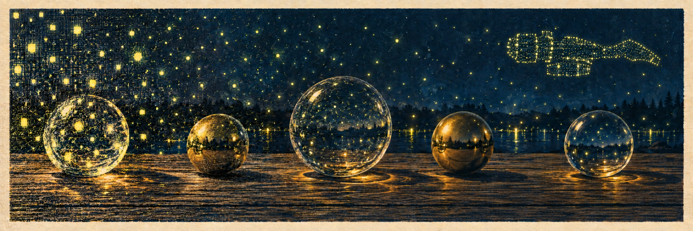

<p align="center">
  
</p>

# Serenity

Serenity is a real-time path tracer I'm writing for one scene: a few glass
and metal spheres on a table at night, lit by hundreds to thousands of
fireflies that never stop moving. The geometry is deliberately simple and
there are no art assets. Everything you see comes from the light, and the
light stays correct as it moves.

It runs natively on Apple silicon through Metal 4, in C++, at the display's
full resolution and 60 frames a second. A second backend,
Vulkan on an AMD Strix Halo, comes later.

**Status: early.** The path a frame takes is built and running end to end:
a frame graph file names the passes a frame runs, the Metal 4 backend renders it,
and it appears in a window at the display's full resolution or is written
to PNG files. What it renders so far is a test pattern; the path tracer is
next. The design is in [`docs/architecture/`](docs/architecture/README.md).

## Why I built it

Lighting a scene with thousands of moving lights is a sampling problem. You
can't trace a ray to every light for every pixel, every frame, so you pick a
few, and the picture is only as good as the picking. ReSTIR (Bitterli et al.,
2020) is the algorithm that made this work in real time: each pixel keeps a
tiny reservoir of light samples and shares it with its neighbors and with the
previous frame. NVIDIA's *Marbles at Night* demo showed what that looks like,
and it's the spirit of this scene.

What interests me is underneath. A frame has a hard deadline, about 16 ms.
Making it means streaming through work in on-chip memory, carrying a few
bytes of state instead of everything you've seen, and merging that state
across neighbors and across time. Those are the same problems I work on in
inference, met from the other side. Serenity is where I get to work on them
with a picture at the end.

The plan, in order:

1. A full path tracer with many moving fireflies, sampled naively. Noisy, on
   purpose: it shows the problem.
2. ReSTIR DI, with spatial and temporal reuse, for the direct light.
3. ReSTIR GI, for the light bouncing between surfaces.
4. Caustics: firefly light focused through the glass onto the table, by
   manifold next event estimation.
5. Reservoir reuse as kernels: what it costs, and where the bytes go.
6. A denoiser of my own, inside the frame budget, compared with Intel Open
   Image Denoise and MetalFX, and against a reference rendered at thousands
   of samples per pixel.
7. The second machine: the same scene on AMD, through Vulkan, and what
   differed.

None of it is built yet; this list says what I'm aiming at, not what exists.

Serenity is R&D under Plainsight Systems LLC.

### Why Serenity

In path tracing, the bright stray pixels that light up a noisy render are
called fireflies. Half the work of a renderer like this one is getting rid of
them, by sampling better and then by denoising. In this scene they're also,
literally, the lights.

So the project is named for what's left when the fireflies are gone: a calm,
clean frame. Noise in, serenity out.

If the name also brings to mind a small ship that kept flying, that's not an
accident, and any Browncoat reading this caught it a paragraph ago. It's why
the metal spheres are polished: they had to be shiny.

## Run it locally

You need an Apple silicon Mac, Xcode 26.2 with its Metal toolchain, CMake
4.2.3, and Python 3.9 or later. Apple's M3 and later trace rays in hardware; earlier
Apple silicon runs the same code in software.

```sh
git clone --recurse-submodules https://github.com/plainsight-systems/serenity.git
cd serenity
make test     # builds, then runs the tests, the GPU tests among them
make check    # structural rules, and tests proving each check fires
make run      # the window, running graphs/test_pattern.toml
make headless # the same frames, as 60 PNGs in frames/
```

`serenity-headless` writes into its `--out` directory only if it is new or
empty, and refuses one that holds anything, so no earlier run's frame sits
beside this run's; `make headless` clears its own frames from `frames/`
first.

`make run GRAPH=graphs/other.toml` runs another frame graph, and `SCENE=` gives
it a scene. The first lit scene, a soft brass sphere on a checkerboard at night
lit by two fireflies:

```bash
make run GRAPH=graphs/preview.toml SCENE=scenes/brass_sphere.toml
```

The naive path tracer, milestone 1, converges while the image holds still:

```bash
make run GRAPH=graphs/path.toml SCENE=scenes/brass_sphere.toml
```

The fireflies awake, each drifting about where it hung. Through the path
tracer the window starts over every frame while they move, so it shows one
noisy sample of each instant, which is what the naive estimator gives:

```bash
make run GRAPH=graphs/path.toml SCENE=scenes/brass_sphere_wander.toml
```

`SCALE=0.5` renders at half the window's resolution each way, for speed.
Escape or closing the window ends it. `make movie` with the same `GRAPH` and
`SCENE` renders ten seconds headless, `SAMPLES` samples of each frame's
instant (64 unless given), and encodes them with ffmpeg into `media/`, which
git ignores.

The build is pinned to one toolchain. Metal can't run in a container, so the
versions of Xcode, the SDK the build compiles against, the Metal compiler,
Apple's clang (as the C, C++ and Objective-C compiler) and CMake are recorded
in [`cmake/toolchain.json`](cmake/toolchain.json), and configuring the build
stops if yours differ. Shaders are compiled when the project builds and
compiled into the binary. The first build fetches metal-cpp, SDL3, toml++,
stb_image_write and doctest, each pinned by commit or by checksum.

## Find your way around

| Path | What it holds |
|---|---|
| `src/core/` | the platform-neutral core: what is rendered, how it moves, the frame's schedule, film and output. No GPU or windowing API |
| `src/metal/` | the Metal backend, the only code that touches Metal: the device, and every shader |
| `src/app/`, `src/headless/` | the two ways to run a frame: in a window, or to files |
| `scenes/` | scene descriptions, as data: what is rendered |
| `graphs/` | frame graphs, as data: which passes a frame runs |
| `cmake/` | the toolchain pin, and how shaders are compiled into the binary |
| `tests/` | tests; `tests/gpu/` runs on this machine's GPU |
| `tools/` | the toolchain and boundary checks |
| `scripts/` | an independent review of a commit, on request |
| `docs/architecture/` | the design, written before the code it describes: start with the [logical overview](docs/architecture/logical-overview.md) |
| `docs/research/` | measurements and investigations, each dated, with the machine and toolchain it ran on |
| `docs/process/` | decisions and the work queue |

The rule that shapes the layout: the core never knows which GPU it runs on.
Only `src/metal/` uses Metal, and the Vulkan backend will sit beside it, so
both machines render the same scene from the same core. `make check` enforces
it.

## Credits

- ReSTIR: Benedikt Bitterli, Chris Wyman, Matt Pharr, Peter Shirley, Aaron
  Lefohn and Wojciech Jarosz, "Spatiotemporal reservoir resampling for
  real-time ray tracing with dynamic direct lighting," SIGGRAPH 2020.
- *Marbles at Night*, NVIDIA's 2020 RTX demo, for showing what many moving
  lights on simple geometry can look like.

## License

Code is licensed under the Apache License 2.0; documentation, prose and
original visual assets under CC BY 4.0. See [`LICENSE`](LICENSE) for the
split, and [`NOTICE`](NOTICE) for third-party components and their licenses.
