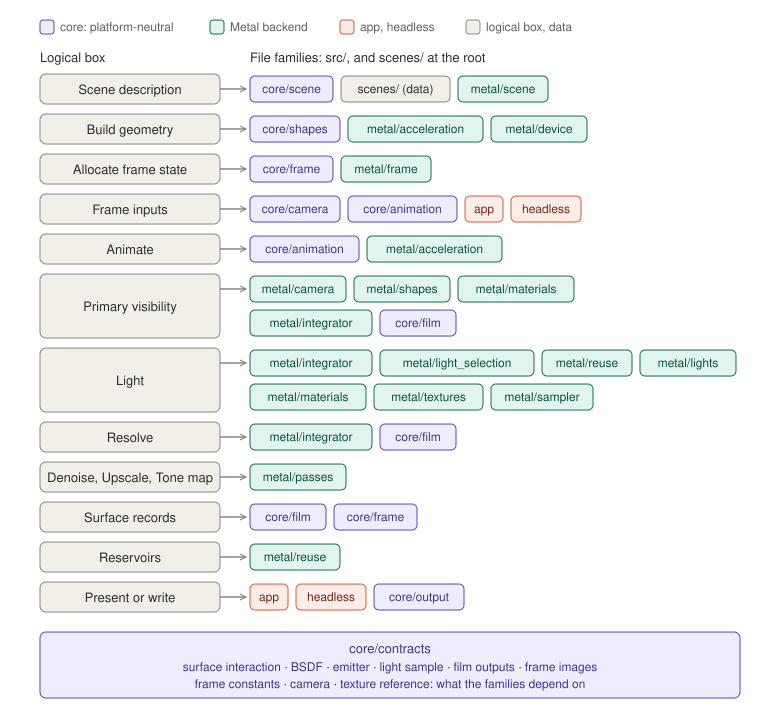

# File mapping

How the boxes in [`logical-overview.md`](logical-overview.md) become files,
applying the axes in [`change-axes.md`](change-axes.md): the algorithm laid
over the axes, which gives the file families.

This is a first pass. It fixes the layers, the families and the direction of
dependencies, and it names the contracts between families. It does not
define the contracts, and it lists no kinds yet: each contract is designed in
its own header before the code that uses it, and each kind arrives with the
change that first needs it. The directories exist now, empty.

## Layers

- **The core, `src/core/`,** is platform-neutral C++: the scene, its kinds'
  parameters, animation, the frame's schedule, film, output and measurement.
  It uses no GPU or windowing API.
- **The Metal backend, `src/metal/`,** is the only code that uses Metal: the
  device, acceleration structures, and every shader with the host code that
  launches it. A Vulkan backend will sit beside it, as `src/vulkan/`.
- **The app, `src/app/`, and the headless renderer, `src/headless/`,** are
  the two ways to run a frame: in a window, with the measured clock, or to
  files, with a fixed step.
- **Scene descriptions, `scenes/`,** are data, at the repository root.

Dependencies point one way: the app and the headless renderer depend on the
backend and the core, the backend on the core, and the core on nothing
platform-specific. Nothing in `src/core/` uses a platform API or includes
from a backend, the app or the headless renderer; `tools/check_boundaries.sh`
enforces that end, and `make check` proves each rule fires.

## Composition

No family knows a feature. A feature is a composition of kinds from several
families, made in the scene description:

- **A firefly** is a sphere *shape*, a sphere *light*, a flight-path
  *animation*, and its color, intensity and path in the scene's data.
- **A glass marble** is a sphere *shape* wearing a dielectric *material*.
- **The table** is a box *shape* wearing a rough *material* whose color comes
  from a wood *texture*.
- **ReSTIR DI** is the *integrator*'s direct-light strategy choosing lights by
  *light selection* and reusing them through *sample reuse*; **ReSTIR GI** is
  the same reuse applied to the integrator's bounces.
- **The reference** is the same integrator with reuse switched off,
  accumulating on the *film*.

Adding a firefly to the scene, or a new kind of thing that glows, changes
data or adds a kind; it does not change a family that already exists.

## The families

| Directory | Axis | Holds |
|---|---|---|
| `src/core/contracts/` | contract | the interfaces between axes (below) |
| `src/core/scene/` | Scene content | reading a scene description into its kinds |
| `src/core/animation/` | Animation | each motion kind: placing an object or light at *t* |
| `src/core/camera/` | Camera | each camera kind's parameters, and its pose at *t* |
| `src/core/shapes/` | Shape | each shape kind's parameters, bounds and geometry for the acceleration build |
| `src/core/materials/` | Material | each material kind's parameters |
| `src/core/textures/` | Texture | each texture kind's parameters |
| `src/core/lights/` | Light | each light kind's parameters |
| `src/core/film/` | Film | what a pixel accumulates and outputs |
| `src/core/frame/` | Frame graph | the passes, their order, the images between them, and the history kept across frames |
| `src/core/output/` | Output | each file format's writer |
| `src/core/measurement/` | Measurement | error against the reference, and timing reports |
| `src/metal/device/` | GPU backend | the device, libraries and pipelines, resources, encoding and synchronization |
| `src/metal/acceleration/` | Acceleration | building and updating the acceleration structures |
| `src/metal/shapes/` | Shape | each shape kind's intersection and point sampling |
| `src/metal/materials/` | Material | each material kind's BSDF |
| `src/metal/textures/` | Texture | each texture kind's evaluation |
| `src/metal/lights/` | Light | each light kind's emission and sampling |
| `src/metal/camera/` | Camera | each camera kind's ray generation |
| `src/metal/sampler/` | Sampler | deriving random numbers from pixel, frame and purpose |
| `src/metal/light_selection/` | Light selection | each strategy for choosing a light |
| `src/metal/integrator/` | Integrator | the path loop, its strategies, and the target function |
| `src/metal/reuse/` | Sample reuse | the reservoir, the merge rule, and temporal and spatial reuse |
| `src/metal/passes/` | Pass | each pass, its shader and its launcher together |
| `src/metal/frame/` | Frame graph | running the core's schedule on Metal |
| `src/app/` | Presentation | the macOS window, its event loop and the measured clock |
| `src/headless/` | Presentation | rendering frames to files at a fixed step |
| `scenes/` | Scene content | scene descriptions, as data |

A kind lives in two halves with the same axis and the same name: its
parameters and anything the CPU needs in the core (a sphere's bounds, for
the acceleration build), and its shader in the backend (the sphere's
intersection). The halves change together when the kind changes, and are
kept as a pair, the way a shader and its launcher are.

## The contracts

Each contract has one owner and is read by the families listed; families
depend on contracts, not on each other.

| # | Contract | Owned by | Read by |
|---|---|---|---|
| 1 | **Surface interaction**: position, normal, surface coordinates, material | Shape | Material, Texture, Integrator |
| 2 | **BSDF**: evaluate, sample, pdf | Material | Integrator, Sample reuse |
| 3 | **Emitter**: emission, sample a point, pdf | Light | Light selection, Integrator, Sample reuse |
| 4 | **Light sample**: which light and which point on it, in its own coordinates | Light | Sample reuse, Integrator |
| 5 | **Film outputs**: radiance, normal, depth, motion per pixel | Film | Pass, Sample reuse |
| 6 | **Frame images**: the images between passes and the history across frames | Frame graph | every Pass |

Each is designed on its own, header first, before the code that uses it.

**How a layout crosses into a shader.** The data a contract passes to the
GPU (a material's parameters, a light sample, a surface record) has one
definition, in a core header that Metal's shading language can also
include: plain fixed-size fields, nothing only the host has. The host writes
the bytes the shader reads, with no second definition to drift. This shares
layouts only, never math. The Vulkan backend's shaders will mirror these
definitions in their own language.

## The algorithm over the families

The per-pixel work, from primary visibility to tone mapping, lives in the
backend; the core holds what is rendered, how it moves, and the schedule:
the core decides what a frame computes and the backend computes it. Light is the
widest box, and it is the split the change axes insist on: the integrator,
light selection, sample reuse, and the lights, materials and textures it
evaluates, each a family of its own.

## Not here yet

- **The kinds.** Each family grows by its first kind when a change needs it:
  the sphere, the box, the dielectric, the sphere light, and so on.
- **The contracts' contents.** Named above; each is its own design.
- **The Vulkan backend.** It arrives as `src/vulkan/`, mirroring
  `src/metal/`'s families, when the AMD machine's milestone comes.
