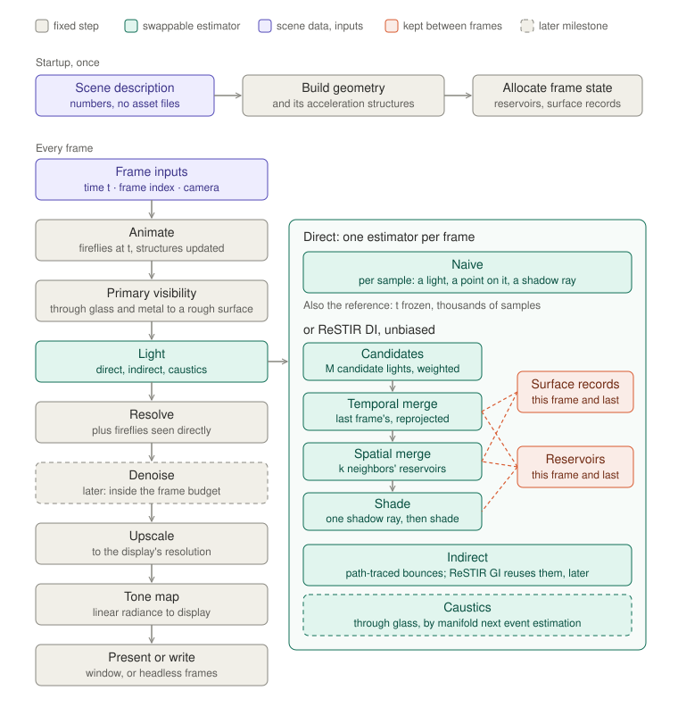

# Logical overview

What the renderer does, and the principles that decide how it does it.

The target is the look of NVIDIA's *Marbles at Night*: glass and polished
metal on a table at night, lit by hundreds to thousands of moving fireflies,
fully path traced: reflections, refractions, light bouncing between surfaces,
and caustics focused through the glass.

This is the **logical** view: phases, responsibilities and principles. It
names no files, no types, no interfaces and no GPU API. The rules that turn
these boxes into files are in [`change-axes.md`](change-axes.md), and the
resulting arrangement in `file-mapping.md`. Every claim here can be checked
against a rendered frame or against the reference.

## The flow

Shading is the same in every figure: **gray** is a fixed step, the same for
every scene and estimator; **teal** is an estimator, swappable per frame;
**purple** is scene data and per-frame inputs; **coral** is state kept from
one frame to the next. A dashed outline is a later milestone.

**Startup** runs once. The scene description is numbers: where the spheres
and the table are, what they are made of, how many fireflies there are and
how each one moves. It is built into geometry and the acceleration
structures rays are traced against, and the state every frame reads and
writes is allocated.

**Every frame** is a function of its inputs: the time *t*, the frame's index
and the camera.

- **Animate** places every firefly where it is at *t*, and updates the
  acceleration structures to match. The fireflies are small glowing spheres:
  geometry that rays can hit, and lights that the estimators sample.
- **Primary visibility** traces a ray from the camera through each pixel. At
  glass it reflects or refracts, chosen by the Fresnel term; at polished metal
  it reflects; it stops at the first rough surface, or when it leaves the
  scene. What it finds is the pixel's **surface record**: position, normal,
  material, the throughput of the glass and metal it passed through, and
  where that surface was in the previous frame. A firefly struck on the way
  is light seen directly, kept for Resolve.
- **Light** estimates what arrives at that rough surface, in three parts:
  - **Direct** light from every firefly, by one of two estimators, chosen per
    frame:
    - **Naive**: for each sample, pick a light, pick a point on it, trace a
      shadow ray.
    - **ReSTIR DI, unbiased** (Bitterli et al. 2020): weigh M candidate
      lights by the light each would deliver, ignoring shadows, and keep one
      in a reservoir; merge in the reservoir this surface held last frame,
      then the reservoirs of k neighbors; trace one shadow ray for the light
      that survives, and shade.
  - **Indirect** light: the path bounces on from the rough surface, through
    glass, off metal and off other rough surfaces, taking direct light at
    each rough surface it reaches. ReSTIR GI (Ouyang et al. 2021) later
    reuses these bounces across pixels and frames as ReSTIR DI reuses light
    samples.
  - **Caustics**: firefly light focused onto a rough surface through glass or
    off metal. A shadow ray cannot bend through a sphere, so these paths are
    found by manifold next event estimation (Hanika, Droske and Fascione
    2015), which solves for the path through the glass directly.
- **Resolve** adds the fireflies seen directly to the light, giving the
  pixel's radiance.
- **Denoise** (later) removes the noise that remains, inside the frame's
  budget.
- **Upscale** brings the image to the display's resolution: rays are traced
  at a lower one, as *Marbles at Night* traced below its output resolution
  and upscaled with DLSS.
- **Tone map** turns linear radiance into display values, and the frame is
  **presented** in the window or **written** by the headless renderer.

The **reference** is the same light transport without reuse: the naive
direct estimator, the same bounces and caustics, time frozen, and thousands
of samples accumulated over frames, at full resolution and with no denoiser
or upscaler. Every other image is judged against it.

The **state kept between frames** is drawn beside the merges rather than as a
step, because that is what it is: the reservoirs and the surface records of
this frame and the last. The merges are the only steps that read them across
pixels or across frames.

## Principles

1. **Time is an input.** A frame is a function of the scene description, *t*,
   the frame's index and the camera. The window passes the time it measured
   and the headless renderer a fixed step, but nothing that renders reads a
   clock. The same inputs give the same image in both.

2. **Randomness is a function of pixel, frame and purpose.** Every random
   number is derived from where and when it is used. There is no shared
   generator state, so any frame can be rendered again exactly, alone.

3. **The reference shares the scene and the light transport, never the
   reuse.** ReSTIR DI and GI are unbiased: averaged over enough frames they
   converge to the same image as the reference. Because the reference does
   none of their resampling, a bug in it cannot pass by matching itself.

4. **Estimators are interchangeable.** Naive and ReSTIR, and ReSTIR with
   temporal reuse, spatial reuse or both, take the same surface records and
   produce the same radiance. Any two can be run on the same frame and
   compared side by side.

5. **Only the merges look beyond their own pixel and frame,** and what they
   see is reservoirs and surface records. Every other step works on one pixel
   alone. Reuse across pixels and time lives in one place, and that is where
   the kernel work concentrates.

6. **A reservoir holds a light sample by identity, not by position.** It
   keeps which firefly and which point on it, in the firefly's own
   coordinates, and the sample is evaluated again wherever it is reused. The
   fireflies move between frames, so a position kept from last frame is
   wrong in this one.

7. **Every light path is counted once.** A firefly's light reaches a rough
   surface only by being sampled from it: in a straight line by the direct
   estimator, or through glass and off metal by manifold next event
   estimation. A bounced ray that strikes a firefly adds nothing, because
   sampling has already counted that light. A firefly struck by the camera's
   path before any rough surface is counted as emission. No path is found two
   ways, so no two strategies need weighting against each other.

8. **The scene is data.** Positions, materials, firefly count, color,
   intensity and motion are numbers in the description. Changing the scene
   never changes code.

9. **A pixel's cost does not grow with the number of lights.** ReSTIR weighs
   a fixed number of candidates per pixel whether there are a hundred
   fireflies or ten thousand. What grows with the count is Animate and
   whatever is built over the lights each frame, and nothing built over them
   outlives the frame, because they move.

10. **The core decides what is computed; a backend decides how.** Both
    backends render the same scene from the same description, and each is
    judged against the reference.

## The design space

What varies, and which principle handles it.

| What varies | Examples | Handled as |
|---|---|---|
| Number of fireflies | hundreds to thousands | scene data (8); no per-pixel cost (9) |
| Firefly motion, color, intensity | per firefly | scene data, evaluated at *t* (1, 8) |
| Geometry | spheres, the table | scene data (8) |
| Material | rough, glass, polished metal | rough surfaces take light; glass and metal are passed through, by the camera's path and by caustic paths |
| Light path | direct, bounced, through glass | one strategy each, never two (7) |
| Camera | still or moving | a frame input (1) |
| Time step | measured, or fixed | a frame input (1) |
| Estimator | naive; ReSTIR temporal, spatial, both | interchangeable (4) |
| Reuse settings | M candidates, k neighbors, history length | settings of the estimator, not code |
| Samples per pixel | one a frame, or thousands for the reference | a setting; the reference is the light transport without reuse (3) |
| Resolution | traced, and displayed | traced lower and upscaled in the window; anything, headless |
| Denoiser | none, our own, Open Image Denoise, MetalFX | a stage after Resolve, judged against the reference |
| Backend | Metal, Vulkan | the core is shared (10) |

Two consequences are worth stating outright:

- **The light count reaches only Animate and the light sampling.** Primary
  visibility, the merges and shading each touch one light per pixel, or a
  fixed number. That is the claim the naive and ReSTIR images make side by
  side: as fireflies are added, the naive image gets noisier and ReSTIR's
  does not.
- **Unbiasedness costs rays.** Merging a reservoir from another frame or
  another pixel is unbiased only if the merge accounts for whether that
  reservoir's sample could have been chosen here, and finding out takes a
  shadow ray. A ReSTIR pixel traces about one ray for the temporal merge, k
  for the spatial merge and one to shade, against the naive estimator's one
  per sample.

## Reservoirs are state keyed on surfaces

A reservoir belongs to a surface, not to a pixel. When the camera or a sphere
moves, the surface a pixel saw last frame is somewhere else on screen, so the
temporal merge looks up last frame's reservoir where this surface was, using
the surface record's previous position. Where there was no such surface,
because it has just come into view, there is nothing to merge and the pixel
starts again from its candidates.

Reuse never decides correctness here, only noise. Unbiased merges weight
every input by whether its sample could have been chosen at this surface, so
a reservoir from a dissimilar surface is weighted down, not trusted. The
surface records exist to choose good neighbors, not to keep the answer right.

The history a reservoir carries is capped. Lights move, and a sample that
was the best choice many frames ago may no longer be; the cap bounds how long
an old choice persists, which trades noise for how quickly the lighting
follows a moving firefly.

## The frame

The window shows the display's full resolution, 3456 x 2234 on the
development machine, at 60 frames a second: 16.7 ms for every step. Rays are
traced at a lower resolution and upscaled; that resolution is set by
measuring the frames once they render, as high as the budget allows. The
headless renderer is not held to the budget: footage is written at any
resolution and any number of samples.

## Platform constraints

**Rays are traced in hardware.** The development machine is an Apple M3 Max,
whose GPU traces rays in hardware, through Metal 4. The second backend
targets an AMD Strix Halo through Vulkan's ray tracing. Neither is assumed to
behave like the other; each is measured on its own.

**No rendering dependencies.** No engine, no ReSTIR library, no denoising
library inside the renderer. Open Image Denoise and MetalFX's denoiser are
baselines the renderer's own denoiser is compared with, not parts of it.
MetalFX's upscaler is the one exception: upscaling is not the demonstration.

**No asset files.** Every shape is procedural and every number is in the
scene description; there is nothing to download and nothing an artist made.
